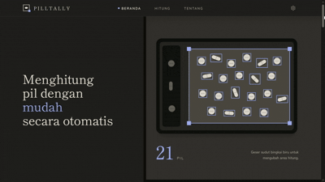
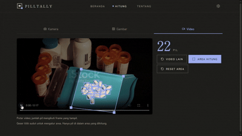

# Pilltally

[](https://www.python.org/)
[](https://docs.ultralytics.com/)
[](https://onnxruntime.ai/)
[](https://fastapi.tiangolo.com/)
[](https://react.dev/)
[](https://www.typescriptlang.org/)
[](https://tailwindcss.com/)
[](https://vite.dev/)
[](https://mlflow.org/)
[](https://github.com/astral-sh/uv)

**Point. Count. Check.**

Counting tablets by hand takes time, and it is easy to lose track halfway through.

**Pilltally** is an automated pill counter that runs in the web browser. Point a camera at the pills, upload a photo, or play a video: Pilltally draws a box around every pill and shows the count. It uses a single-class **YOLO26n** detector trained on three public datasets (8,615 images, 33,319 pills). Live camera and video run **on the user's device** with ONNX Runtime Web; photos are counted on a small FastAPI server. There is nothing to install and no account.

---

## Preview

### Home


### Counting


---

## What It Does

- **Three input modes in one app**: live camera, photo upload, and a video file played in the browser, all with the same result view (a box on each pill and one big number).
- **Runs in the browser**: camera and video frames are processed on the device (WebGPU, with a WASM fallback) inside a Web Worker, so the page stays smooth while the model runs.
- **Private by default**: camera and video frames stay on the device. Photos are sent only as a resized copy without camera metadata, and the backend does not save them. There is no login, history, or database (see [Privacy](#privacy)).
- **Adjustable counting area**: drag 4 corner points to count only the pills inside a region, for example one tray compartment. The same area applies to every mode.
- **Stable live counts**: a lightweight tracker and a short count smoother stop the number from flickering when a box drops out for one frame.
- **Transparent model**: the About page shows the dataset, preprocessing, threshold choice, and test metrics, read live from the deployed model's `model_info.json`.
- **Bilingual and themed**: Indonesian and English for every text, plus light, dark, and system themes.

---

## How It Works

Pilltally uses a **hybrid architecture**: continuous video work stays on the device, single photos go to the server.

```text
                        ┌──────────────── Browser ────────────────┐
 Live camera / video ──►│ Web Worker + ONNX Runtime Web           │
                        │ (WebGPU → WASM fallback)                │──► boxes + count
                        │ letterbox 640 → YOLO26n → score ≥ 0.65  │    (nothing uploaded)
                        │ → NMS (IoU 0.7) → tracker → smoother    │
                        └─────────────────────────────────────────┘

                        ┌────────────── FastAPI server ───────────┐
 Photo upload ─────────►│ resized to ≤1280 px in the browser      │
 (+ optional area)      │ → letterbox 640 → YOLO26n (onnxruntime) │──► boxes + count
                        │ → score ≥ 0.65 → NMS → area filter      │    (image not stored)
                        └─────────────────────────────────────────┘
```

### 1. One model, two runtimes
The same ONNX file (`ml/models/pilltally_yolo26n.onnx`) runs in Python on the server and in the browser. The browser downloads it from `/api/v1/model/file?v=<run_id>`; the run id in the URL lets the browser cache it for a year and fetch it again only when a new model is promoted.

### 2. Identical preprocessing on both sides
Letterboxing, thresholding, and NMS are written twice (Python and TypeScript). **Parity tests** guard them: a script in `backend/scripts/` writes reference outputs from the Python code, and the TypeScript tests must reproduce them.

### 3. Counting rule
A pill is counted when its box score is at least the model's `conf_threshold` (0.65, chosen on the validation set) and, if a counting area is set, its box **center** lies inside the area.

### 4. Live mode
Detection runs one frame at a time (as fast as the device allows) while boxes are drawn every animation frame. A tracker keeps a pill once it has been seen twice, holds it while its score stays above 0.4, and forgets it after 3 missed frames. The screen shows the most frequent count of the last 5 rounds.

### 5. Light pages
Home and About never run the model. They only download it in the background when the browser is idle, so the Count page can start quickly.

---

## Privacy

There is no login, no history, and no database.

---

## Results

Evaluated on held-out data that was never used for training or model selection. The model and its threshold were chosen on the **validation** set (lowest count MAE); the test set is only reported.

### Counting

| Split | Images | MAE | Exact count | Within ±1 pill |
| :--- | ---: | ---: | ---: | ---: |
| Validation | 559 | 0.034 | 96.6% | 100% |
| **Test** | **335** | **0.006** | **99.4%** | **100%** |

Every counting error on both splits is off by exactly one pill.

Per dataset (test):

| Dataset | Test images | MAE | Exact count |
| :--- | ---: | ---: | ---: |
| CountingPills | 175 | 0.006 | 99.4% |
| Pill Detection | 148 | 0.000 | 100% |
| medical-pills | 12 | 0.083 | 91.7% |

### Detection

| Split | Precision | Recall | F1 | mAP50 | mAP50-95 |
| :--- | ---: | ---: | ---: | ---: | ---: |
| Validation | 0.997 | 0.996 | 0.996 | 0.995 | 0.887 |
| Test | 0.999 | 0.999 | 0.999 | 0.995 | 0.909 |

### Threshold Choice (validation MAE)

| Threshold | 0.40 | 0.50 | 0.60 | **0.65** | 0.70 | 0.75 | 0.80 |
| :--- | ---: | ---: | ---: | ---: | ---: | ---: | ---: |
| Val MAE | 0.041 | 0.039 | 0.038 | **0.034** | 0.039 | 0.048 | 0.082 |

---

## Known Limitations

1. **Limited dataset conditions.** All images come from three public datasets, mostly loose pills on counting trays and studio shots. Phone cameras, home lighting, varied backgrounds, capsules, blister packs, and touching or overlapping pills are barely covered, and there is no test set from real app use. The medical-pills source is also very small (23 validation and 12 test images).
   *Future work:* the dataset should be enriched with more varied conditions, and a separate test set of phone photos and videos taken in real app use should be built to measure field accuracy.
2. **One training run, default settings.** Because of limited compute (a free Kaggle T4 GPU), only one baseline scenario was trained: Ultralytics default hyperparameters, 50 epochs, no tuning. The run used all 50 epochs without early stopping, so longer training might still help.
   *Future work:* hyperparameter tuning (learning rate, epochs, batch size, augmentation, and input size) and training with several seeds are needed to find better settings and measure how stable the metrics are.
3. **The smallest model size.** YOLO26n (nano) was chosen so the model can run in a phone browser. Larger variants may be more accurate on dense or overlapping pills but have not been tried. Even the nano model runs at under 8 FPS on a mid-range phone.
   *Future work:* the n, s, and m sizes could be compared on accuracy against phone speed, and a smaller input or FP16/INT8 quantization could be studied for live mode.

---

## Project Architecture

```text
pilltally/
├── frontend/                 # React + Vite web app (Home, Count, About)
│   ├── public/               # Favicon
│   ├── vite/                 # Vite plugin that serves the ONNX Runtime Web files
│   └── src/
│       ├── app/              # Router, layout, locale and theme providers
│       ├── components/       # Shared layout (Navbar, Footer) and UI primitives
│       ├── content/          # All page text, Indonesian + English
│       ├── features/         # home, counting, about, faq
│       │   └── counting/     # Camera, video, photo modes; worker; tracker; pure lib/ + tests
│       ├── pages/            # One file per route
│       ├── services/         # Axios API client
│       └── styles/           # Design tokens, type scale, self-hosted fonts
│
├── backend/                  # FastAPI + onnxruntime API
│   ├── app/
│   │   ├── api/v1/           # /health, /api/v1/model/*, /api/v1/predict
│   │   ├── core/             # Settings (PILLTALLY_* env vars), logging
│   │   ├── schemas/          # Pydantic response models
│   │   └── services/         # Model loader, image processor, predictor
│   ├── scripts/              # Parity fixture generator for the frontend tests
│   └── tests/
│
├── ml/                       # Training pipeline
│   ├── configs/              # One YAML per stage, validated with Pydantic
│   ├── notebooks/            # Exploratory data analysis
│   ├── pipelines/            # run_xxx() entry points: download → prep → train → evaluate → export → promote
│   ├── src/                  # Pure, tested logic: data, models, evaluation, utils
│   ├── tests/
│   └── models/               # Promoted model: .onnx, .pt, model_info.json
│
└── .github/assets/           # README media
```

Each part has its own README with details:

- [`frontend/README.md`](frontend/README.md): structure, browser inference, live tracking, scripts
- [`backend/README.md`](backend/README.md): API reference, settings, preprocessing
- [`ml/README.md`](ml/README.md): datasets, splits, pipelines, metrics, MLflow

---

## Technology Stack

### Frontend
- **Framework**: React 19, TypeScript 6, React Router
- **Tooling**: Vite 8, Vitest, ESLint
- **Styling**: Tailwind CSS v4 with semantic design tokens
- **Inference**: ONNX Runtime Web (WebGPU and WASM) in a Web Worker
- **Typography**: Shippori Mincho and Zen Kaku Gothic New (self-hosted)
- **Icons / HTTP**: Lucide React, Axios

### Backend
- **Framework**: FastAPI, Uvicorn
- **Validation**: Pydantic v2, `pydantic-settings`
- **Inference**: onnxruntime (CPU), NumPy, Pillow
- **Environment**: Python 3.11+, uv, Ruff, pytest

### Machine Learning
- **Model**: Ultralytics YOLO26n (COCO-pretrained, fine-tuned on one class)
- **Tracking**: MLflow (SQLite backend)
- **Export**: ONNX, onnxslim
- **Data**: Roboflow API, pandas, OpenCV, Pillow
- **Training hardware**: Kaggle GPU (T4), imported into the local MLflow store

---

## Quick Start

### 1. Prerequisites
- **Python** 3.11+ and [uv](https://docs.astral.sh/uv/)
- **Node.js** 20+ and npm
- The promoted model in `ml/models/` (`pilltally_yolo26n.onnx` and `model_info.json`)

### 2. Clone the Repository
```bash
git clone https://github.com/Falrlz/pilltally.git
cd pilltally
```

### 3. Run the Backend
```bash
cd backend
uv sync
uv run python -m pytest
uv run uvicorn app.main:app --reload --port 8000
```
Interactive API docs: `http://127.0.0.1:8000/docs`.

### 4. Run the Frontend
In a second terminal:
```bash
cd frontend
npm install
npm test
npm run dev
```
Open `http://localhost:5173/`. Requests to `/api` and `/health` are proxied to the backend.

To try the camera on a phone in the same Wi-Fi network, run `npm run dev:phone` instead. It serves over HTTPS (browsers only allow the camera on secure pages) and prints a network address to open on the phone.

### 5. Train or Inspect the Model (Optional)
```bash
cd ml
uv sync
cp .env.example .env              # add ROBOFLOW_API_KEY
uv run python -m pipelines.download_pipeline
uv run python -m pipelines.data_prep_pipeline
uv run python -m pipelines.full_pipeline
uv run mlflow ui --backend-store-uri sqlite:///outputs/mlflow/mlflow.db
```
See [`ml/README.md`](ml/README.md) for choosing and promoting a model.

---

## Testing

| Part | Command | Tests |
| :--- | :--- | ---: |
| Frontend | `npm test` | 110 |
| Backend | `uv run python -m pytest` | 48 |
| ML | `uv run python -m pytest` | 35 |

On Windows, use `uv run python -m pytest`; plain `uv run pytest` can fail because of the uv launcher.

---

## Acknowledgements

Pilltally is built on public datasets and open-source tools shared by others:

- **CountingPills** dataset, [Roboflow Universe](https://universe.roboflow.com/countingpills-rbjwo/countingpills) (v36)
- **Pill Detection** dataset (74 Korean pill types), [Roboflow Universe](https://universe.roboflow.com/pilldetection-qsfgv/pill-detection-tbmmm) (v22)
- **Medical Pills** dataset, [Ultralytics](https://docs.ultralytics.com/datasets/detect/medical-pills/)
- **YOLO26** and the training framework by [Ultralytics](https://github.com/ultralytics/ultralytics)
- **ONNX Runtime** and **ONNX Runtime Web** by [Microsoft](https://onnxruntime.ai/)

Each dataset and library keeps its own license and terms.

---

## Disclaimer

Pilltally was developed for academic, research, and educational purposes. Its counts are an aid, not a guarantee: accuracy depends on lighting, background, camera angle, and how the pills lie, and mistakes can happen. Always check counts that matter, especially when dispensing medicine. Pilltally is **not** a certified medical device.
